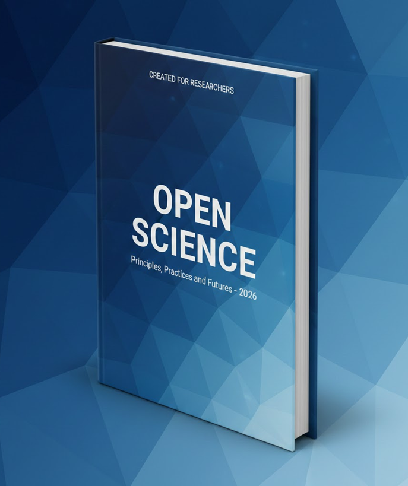

# 📘 Open Science — Principles, Practices and Futures (2026)

Landing page oficial do ebook **“Open Science: Principles, Practices and Futures – 2026”**, um guia prático e conceitual para pesquisadores, estudantes, instituições acadêmicas e profissionais interessados em **Ciência Aberta**.

---

## 🌍 Sobre o Projeto

Este repositório contém o código-fonte de uma **landing page moderna, responsiva e minimalista**, criada para divulgar e distribuir o ebook **Open Science (2026)**.

O projeto foi desenvolvido com foco em:

- Comunicação clara de valor
- Design acadêmico e contemporâneo
- Boas práticas de acessibilidade e responsividade
- Performance e simplicidade

---

## 🎯 Objetivo do Ebook

O ebook tem como objetivo apresentar:

- Os **fundamentos da Ciência Aberta**
- Práticas contemporâneas adotadas em 2026
- Open Access, Open Data e Open Software
- Reprodutibilidade científica
- Transparência e ética na pesquisa
- O futuro da ciência aberta no contexto global

---

## 🧩 Estrutura da Landing Page

A landing page segue um modelo clássico de alta conversão:

- **Hero Section**
  - Headline clara e objetiva
  - Descrição do valor do ebook
  - Call-to-action (CTA) com captura de e-mail
  - Mockup 3D do ebook

- **What’s Inside**
  - Visão geral dos capítulos
  - Principais tópicos abordados

- **Call to Action**
  - Download de preview / fragmento do ebook

- **Design**
  - Paleta em tons de azul
  - Estilo geométrico moderno
  - Tipografia sans-serif limpa

---

## 🛠️ Tecnologias Utilizadas

- HTML5
- CSS3
- JavaScript 
- Frameworks modernos 
  - React / Next.js
- Design responsivo (Mobile First)

---

## 🚀 Como Executar Localmente

- Clone o repositório
git clone https://github.com/seu-usuario/open-science-landing-page.git

- Acesse a pasta
cd open-science-landing-page

- Abra o index.html no navegador

## Público-Alvo

- Pesquisadores

- Estudantes de graduação e pós-graduação

- Universidades e instituições de pesquisa

- Profissionais interessados em ciência aberta

- Políticas públicas e inovação científica

## 📄 Licença

 Este projeto é distribuído sob a licença MIT.
 Sinta-se à vontade para usar, modificar e adaptar, mantendo os créditos.

## ✍️ Autor

 Arthur Syllos
 Pesquisador e desenvolvedor interessado em Ciência Aberta, tecnologia e inovação.

## ⭐ Contribuições

 Contribuições são bem-vindas!
 Sinta-se livre para abrir uma issue ou enviar um pull request.